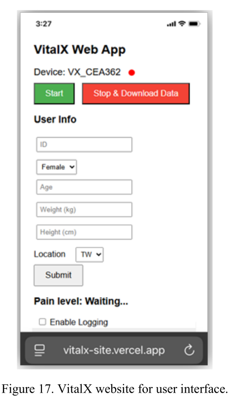
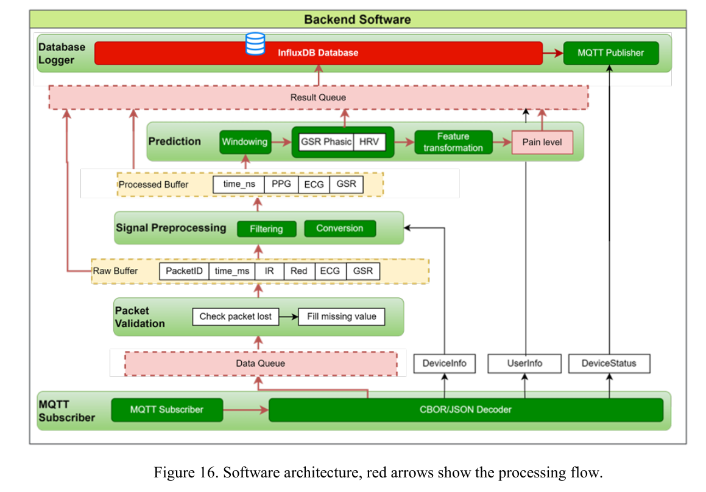
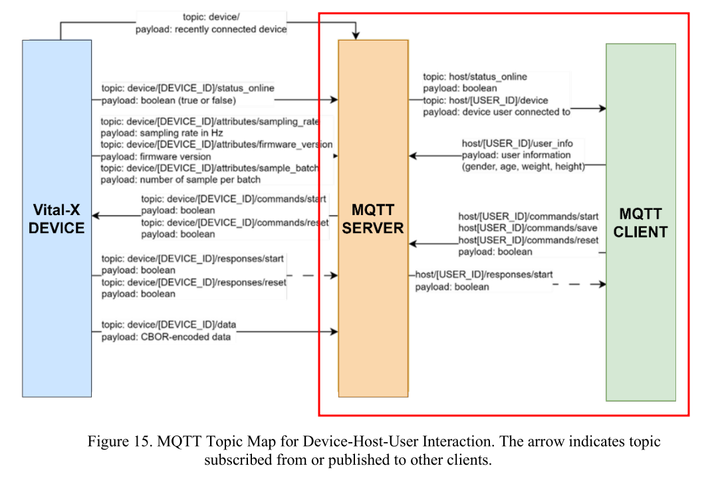

# Vital-X Software

Vital-X streams ECG, PPG, and EDA/GSR measurements to a Python backend over MQTT. The backend processes the incoming signals, estimates a pain level, and stores measurements for monitoring and later review.

This repository contains the server backend and presentation materials. The thesis describes a mobile-friendly web interface hosted separately; its source code is not present in this repository snapshot (`software/vitalx_site/` is empty).

## Demo

[](assets/demo.mp4)

[Open or download the demo video](assets/demo.mp4) (`assets/demo.mp4`). GitHub does not reliably play repository-relative MP4 files inline in README pages; use the preview or link to open the video.

## System Overview

The device sends CBOR-encoded data through an MQTT broker. The backend subscribes to device topics, decodes and validates packets, and passes the signal batches through preprocessing and pain assessment. Raw and processed signals, extracted features, and pain estimates are written to InfluxDB. Pain and pulse-rate estimates are also published over MQTT. When measurement stops, the logger exports processed data to CSV and attempts an optional Google Drive upload; Drive upload is not verified as ready to use without additional setup.



The MQTT topic map below shows the device, server, and client communication described in the thesis.



## Backend Pipeline

The backend code is in [`software/ServerBackend/`](software/ServerBackend/):

1. `mqtt_subscriber.py` connects to the broker, tracks device status and configuration, decodes CBOR messages, and receives user information.
2. `packet_processor.py` checks packet fields and sample lengths, pads or truncates malformed batch lengths, and handles missing packet IDs. A single missing packet is interpolated; multiple missing packets are represented as missing data.
3. `data_processor.py` converts GSR readings to conductance, filters ECG, PPG, and GSR, estimates pulse rate, and prepares prediction windows.
4. `pain_assessor.py` extracts GSR and HRV features with NeuroKit2 and applies the saved scaler, PCA transform, and voting-classifier model.
5. `database_logger.py` writes raw signals, processed signals, features, and pain estimates to InfluxDB. At the end of a measurement, it exports processed data to CSV and optionally uploads it to Google Drive.
6. `main.py` configures and starts the MQTT subscriber, packet processor, data processor, and database logger.

The prediction window is configured as 5.5 seconds in `main.py`. The thesis describes the classifier as a five-class ensemble and its prediction interval as approximately five seconds.

## Run the Backend

### Requirements

- Python and the packages in [`software/ServerBackend/requirements.txt`](software/ServerBackend/requirements.txt)
- An MQTT broker and a Vital-X device publishing the expected device topics
- A reachable InfluxDB instance, organization, bucket, and API token
- The trained model artifacts: `pain_votingclassifier_J.pkl`, `scaler.pkl`, and `pca.pkl`
- The MQTT TLS certificate configured for your broker
- Google Drive OAuth credentials only if Drive export is required

The model files and deployment credentials are not included in this repository. MQTT username/password and the InfluxDB token must be provided through environment variables; the backend exits with an error if they are missing. Configure machine-specific certificate and model paths before running. Never commit live credentials, and rotate any credentials that may already have been exposed in repository history.

### Install

From the repository root:

```bash
python3 -m venv .venv
source .venv/bin/activate
python -m pip install -r software/ServerBackend/requirements.txt
```

Set the MQTT credentials and InfluxDB token in the environment. For example:

```bash
export MQTT_BROKER="your-mqtt-host"
export MQTT_PORT="8883"
export MQTT_USERNAME="your-mqtt-username"
export MQTT_PASSWORD="your-mqtt-password"
export INFLUXDB_TOKEN="your-influxdb-token"
```

Before starting the service, update the InfluxDB URL, organization, and bucket, and point the certificate and model paths in `software/ServerBackend/main.py` to files available on your machine. The thesis specifies a 512 Hz sampling rate for compatibility with the prediction model.

#### Optional Google Drive Setup

For Drive export, create OAuth client credentials in the Google Cloud Console and enable the Google Drive API. By default, put the downloaded OAuth client JSON at `software/ServerBackend/resources/credentials.json`; the OAuth token is created at `software/ServerBackend/resources/token.json` after the first authorization. Both filenames are ignored by Git. To store either file elsewhere, configure these variables before starting the backend:

```bash
export GOOGLE_CREDENTIALS_PATH="/path/to/google-oauth-client.json"
export GOOGLE_TOKEN_PATH="/path/to/vitalx-drive-token.json"
```

The token parent directory is created automatically. Keep custom credential and token files outside the repository or add their paths to `.gitignore`. Drive authentication alone does not complete the current upload flow: folder initialization is disabled in `database_logger.py`, so enable its `get_or_create_folder()` call before expecting uploads to work.

Start the backend from its directory so its local module imports resolve:

```bash
cd software/ServerBackend
python main.py
```

Stop the service with `Ctrl+C`. The logger writes exported CSV files to `software/ServerBackend/data/`.

## Scope and Limitations

This is a research prototype, not a clinically validated medical device. The thesis reports that pain-prediction accuracy has not been validated in a clinical setting and identifies ECG lead-off monitoring and real-time pain alerts as unimplemented features. Confirm that the model artifacts, sensor sampling rate, broker topics, and backend configuration match your deployment before interpreting results.

## Thesis

See the [thesis report](assets/report.pdf) for the full project background, device and software design, evaluation, MQTT topic map, and user-interface presentation.
